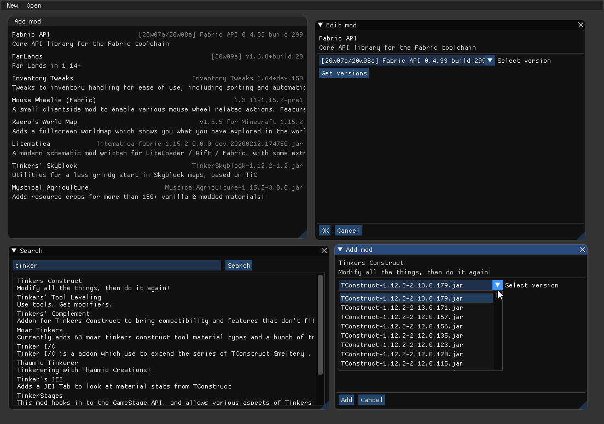

# Cursed Obsidian [WIP]
###### great name i know
manages downloading/updating mods from curseforge



current code is A mess
# Setup
as the project is still work in progress, this will likely change
```bash
pip install -r requirements.txt
# on linux install these packages
python3-tk libglfw3
```
# Usage
```bash
python main.py
```